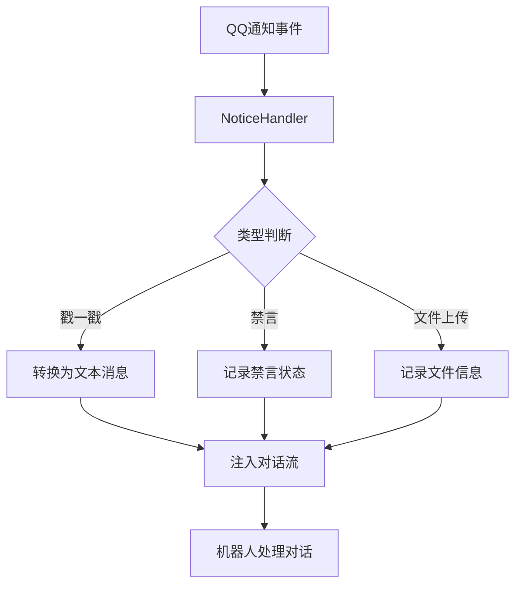

# Notice Injector 通知处理器

> *把QQ的"小动作"，变成机器人的"懂你"。*

**QQ通知消息处理与主动交互插件** — Neo-MoFox 插件

---

## ✨ 不止是通知，更是连接

普通的通知系统是一道墙：机器人收到了，但不知道怎么回应。

Notice Injector 不一样。它会：

- 把"戳一戳"变成机器人能看懂的消息："用户A戳了戳你"
- 还能让机器人主动去戳一戳，像真人一样互动

这不是简单的消息转发，这是**通知语义化**驱动的交互桥梁。

### 它能做什么

#### 接收通知，转化理解
- **戳一戳通知** — 有人戳机器人时，转化为文本消息注入对话
- **禁言通知** — 有人被禁言/解除禁言时，记录到对话历史
- **文件上传通知** — 群里有人上传文件时，通知机器人处理

#### 主动交互，拉近距离
- **发送戳一戳** — 机器人可以主动戳一戳用户引起注意
- **AOE 戳一戳** — 机器人可以同时戳多个活跃用户（每人一次）
- **群文件下载** — 机器人可以下载群内上传的文件并阅读内容
- **全场景支持** — 所有功能同时支持私聊和群聊

---

## 🏗 架构

### 原生 Action 支持

Notice Injector 通过框架的原生 Action 系统提供交互能力：

| 动作                        | 用途                     | 适用场景 | 参数                                   |
|----------------------------|--------------------------|----------|----------------------------------------|
| `send_group_poke`          | 群聊单用户连戳多次        | 仅群聊   | `user_id`(可选，QQ号或昵称), `poke_count`(可选), `target_user_id`(可选，QQ号或昵称) |
| `send_private_poke`        | 私聊单用户连戳多次        | 仅私聊   | `user_id`(可选，QQ号或昵称), `poke_count`(可选), `target_user_id`(可选，QQ号或昵称) |
| `send_group_poke_multiple` | 群聊多用户各戳一次（AOE） | 仅群聊   | `user_ids`(必选，QQ号或昵称), `max_targets`(可选，默认5), `validate_targets`(可选，默认true) |
| `download_group_file`      | 下载群文件到本地并返回路径 | 仅群聊   | `file_name`(必选，从上传通知中获取的文件名) |

**架构优化说明**：
- 戳一戳功能已拆分为群聊和私聊独立 Action，框架会根据 `chat_type` 自动过滤
- 群聊环境：LLM 只能看到 `send_group_poke` 和 `send_group_poke_multiple`
- 私聊环境：LLM 只能看到 `send_private_poke`
- 无降级逻辑，避免群聊误触私聊或反之

### 通知处理流程



---

## 📁 文件结构

```
notice_injector/
├── manifest.json            # 插件元数据
├── plugin.py                # 插件入口，注册组件与事件
├── config.py                # 配置定义
├── file_capture.py          # NapCat 文件捕获模块（WebSocket 监听 + HTTP 下载）
├── LICENSE                  # MIT 许可证
├── README.md                # 插件文档
└── actions/
    ├── __init__.py          # Actions 模块导出
    ├── poke.py              # 戳一戳动作实现（群聊/私聊/AOE）
    └── download.py          # 群文件下载动作实现
```

---

## ⚙️ 配置

配置文件首次运行自动生成，路径：`config/plugins/notice_injector/config.toml`

### 配置节：`[plugin]`

> 当前插件所有配置均位于 `[plugin]` 下（无 `[features]` 节）。

| 配置项 | 默认值 | 说明 |
|---|---:|---|
| `enabled` | `true` | 插件总开关 |
| `enable_poke` | `true` | 是否处理戳一戳通知 |
| `enable_ban` | `true` | 是否处理禁言通知 |
| `enable_group_upload` | `true` | 是否处理文件上传通知 |
| `enable_debug` | `false` | 是否输出调试日志 |
| `ignore_self_notice` | `true` | 是否忽略机器人自己触发的通知 |
| `enable_file_capture` | `true` | 是否启用群文件捕获服务（连接 NapCat SSE 服务器的 WebSocket） |
| `napcat_ws_url` | `ws://127.0.0.1:9999` | NapCat SSE 服务器的 WebSocket 地址，需与 NapCat httpSseServers 端口一致 |


## 🎯 戳一戳行为说明

**架构设计**：
- `send_group_poke`：群聊单用户连戳（`chat_type=GROUP`）
- `send_private_poke`：私聊单用户连戳（`chat_type=PRIVATE`）
- `send_group_poke_multiple`：群聊 AOE 戳（`chat_type=GROUP`）
- 框架会根据环境自动过滤，不会出现群聊调用私聊 Action 的情况

**通用规则**：
- 次数裁剪：实际连戳次数限制在 `[1, min(max_poke_count, 10)]`
- 目标优先级：`target_user_id` > `user_id`，`target_group_id` > `group_id` > 上下文推断
- 目标解析：`user_id`/`target_user_id` 可填 QQ 号或昵称；昵称依次按本地用户库、群成员列表解析，无法唯一确定时直接取消，不执行戳一戳
- 群聊安全：群聊 Action 缺失 `group_id` 时直接取消，不会降级为私聊
- 校验策略：
  - 群聊：`validate_target_before_poke=true` 且 `validate_target_in_group=true` 时使用 `get_group_member_info`
  - 私聊：`validate_target_before_poke=true` 且 `validate_target_in_private=true` 时使用 `get_stranger_info`
  - 私聊默认不校验（避免额外 API 调用）

**AOE 戳一戳特性**：
- 与单用户连戳互斥，二选一使用
- 每人只戳一次，不支持连戳
- 人数上限由 `max_targets` 控制（默认 5，硬上限 10）
- LLM 应从上下文判断"活跃用户"，建议从最近消息中提取
- 目标校验默认开启，会过滤无效用户无效用户
- AOE 戳一戳仅支持群聊

### 群文件下载

`download_group_file` 动作通过直接连接 NapCat SSE 服务器的 WebSocket 端口，独立于 onebot_adapter 捕获群文件上传事件中的 `file_id` 和 `busid`，从而实现文件下载。

**工作原理**：
- 插件启动时，`FileCapture` 模块会建立一条到 NapCat SSE 服务器的 WebSocket 连接（与现有 onebot_adapter 的连接互不干扰）
- 当群内有人上传文件时，`FileCapture` 从原始事件中提取 `file_id`、`busid` 等元数据并缓存
- LLM 决定需要读取文件时，调用 `download_group_file` 动作，传入文件名
- 动作通过 NapCat WebSocket API 获取临时下载链接，将文件下载到 `data/group_files/` 目录
- 下载完成后返回本地路径，LLM 可使用 MCP 工具阅读文件内容

**前置要求**：
- NapCat 的 `httpSseServers` 已启用，且 `enableWebsocket` 为 `true`
- 配置中的 `napcat_ws_url` 和 `napcat_http_base` 需与 NapCat 的 SSE 服务器端口匹配

### 推荐配置（低延迟+稳健）

```toml
[plugin]
# 插件总开关：false 时本插件完全停用
enabled = true

# 通知处理类型开关
enable_poke = true
enable_ban = true
enable_group_upload = true

# 调试日志（排障时开启）
enable_debug = false

# 是否忽略机器人自己产生的通知（避免自循环）
ignore_self_notice = true

# 是否把通知注入对话触发聊天（false 可显著节省 token）
trigger_chat = false

# 连戳次数上限（运行时硬上限=10）
max_poke_count = 3

# 连戳随机间隔区间（毫秒）
poke_interval_min_ms = 100
poke_interval_max_ms = 200

# 发送前目标校验总开关（程序内 API 校验，不消耗 LLM token）
validate_target_before_poke = true

# 分场景校验开关：推荐群聊开、私聊关
validate_target_in_group = true
validate_target_in_private = false

# 群文件捕获（需要 NapCat SSE 服务器已启用 WebSocket）
enable_file_capture = true
napcat_ws_url = "ws://127.0.0.1:9999"
```

---

## 🔧 安装

将 `notice_injector/` 目录放入 Neo-MoFox 的 `plugins/` 文件夹，首次启动自动生成配置。

**要求**：Neo-MoFox >= 2.0.0 · Python >= 3.11

---

## 📜 许可证

MIT License
